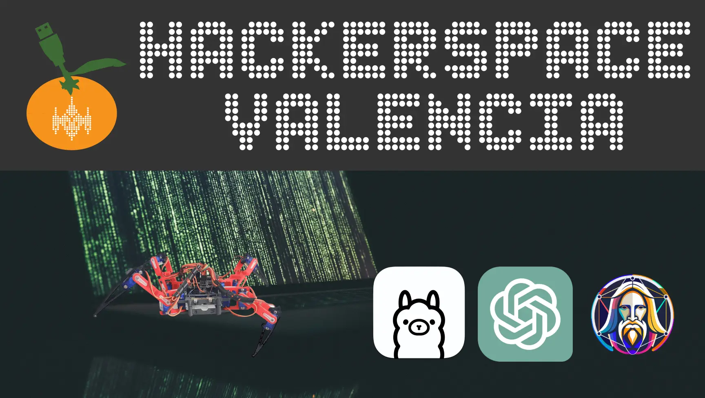

(credits to Enrique Domínguez, co-author of the talk)

The following is a summary generated by Gemini 1.0 Pro 1M context window, from the transcription retrieved with OpenAI's Whisper from the talk.

You can see the talk in Spanish in [Youtube](https://www.youtube.com/watch?v=7SLHjoDxL8c)

# Summary of the Generative Artificial Intelligence Workshop at Hackerspace (part 1) Valencia

## Workshop Introduction
The workshop focused on generative artificial intelligence, covering everything from fundamentals to practical applications. The main objectives included understanding large language models (LLMs), exploring real-world applications, and demonstrating practical implementations. The session aimed to share knowledge and experiences in the field of generative AI, motivating attendees to explore and develop their own projects.

## Tools and Applications Discussed

### MidJourney
MidJourney was introduced as an advanced tool for creating images based on textual prompts. This tool stands out for its image quality and accessibility through web interfaces, allowing users to generate art with ease. Despite its advantages, limitations such as restricted customization and occasional errors were mentioned.

### Stable Diffusion
Stable Diffusion was presented as an open-source solution for creating images and texts. Its open-source nature promotes privacy, allows for extensive customization, and has an active community that constantly contributes to the tool's development and improvement. Stable Diffusion operates locally, which is a plus in terms of data control and privacy.

### Leonardo.ai
Leonardo.ai was discussed as a platform based on Stable Diffusion that offers image generation services through prompts. Being a free solution, it facilitates exploration and experimentation in visual content generation, using renewable daily credits for image creation.

## Key Aspects of Generative Artificial Intelligence

### Large Language Models (LLMs)
The practical use of LLMs for tasks such as language translation and baby name generation was explored in depth. The use of tools like Olama to run language models locally was highlighted, providing greater control and customization over generated results.

### Practical Applications
Practical cases of generative AI application were shared, including the creation of conversational interfaces and the generation of creative content. Personal projects of the presenters were also explored, demonstrating the potential of these technologies in creative and technical fields.

## Projects at Hackerspace (part 1) Valencia and Future Workshops

### Current and Future Projects
The workshop served as a platform to discuss ongoing and future projects at Hackerspace (part 1) Valencia, such as programming workshops, Arduino use, and PCB design with Kikad. The possibility of organizing additional workshops focused on generative artificial intelligence was raised.

### Suggestions for Upcoming Workshops
The community expressed interest in delving even deeper into generative artificial intelligence, suggesting future workshops that address more specific practical applications, such as developing Jarvis-style personal assistants and home automation.

## Resources and Recommendations for the Community

### Learning Sources and Community
It was recommended to follow specialized YouTubers and participate in online communities to stay up to date with the latest trends and developments in generative AI. Additionally, exploring GitHub to discover relevant projects and tools was suggested, encouraging attendees to actively contribute and participate in these ecosystems.

## Workshop Conclusion
The workshop concluded with thanks to the participants and Hackerspace (part 1) Valencia for providing the space and resources to carry out the session. Attendees were encouraged to continue exploring the field of generative artificial intelligence and to participate in future activities and projects organized by the Hackerspace (part 1).