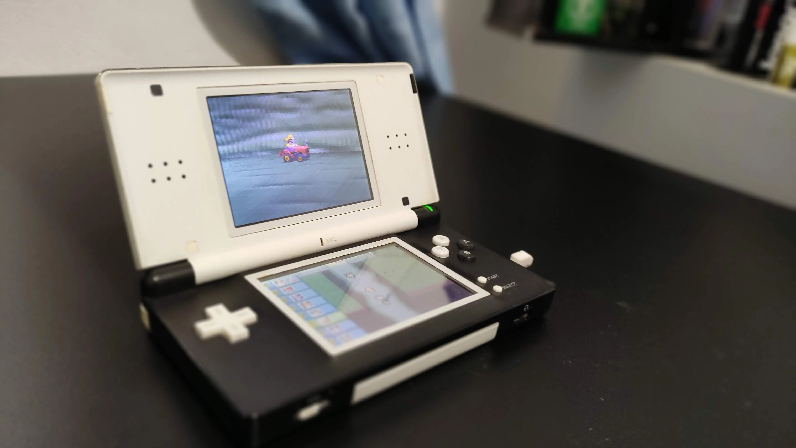
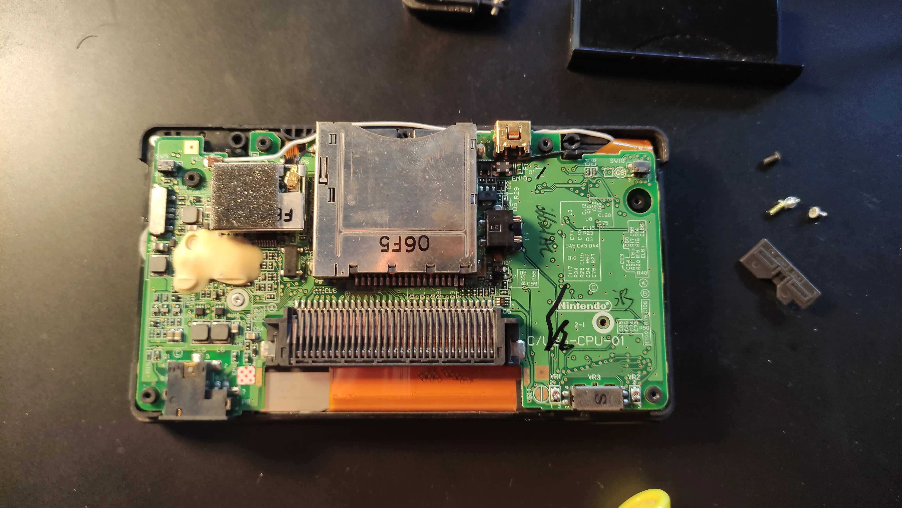
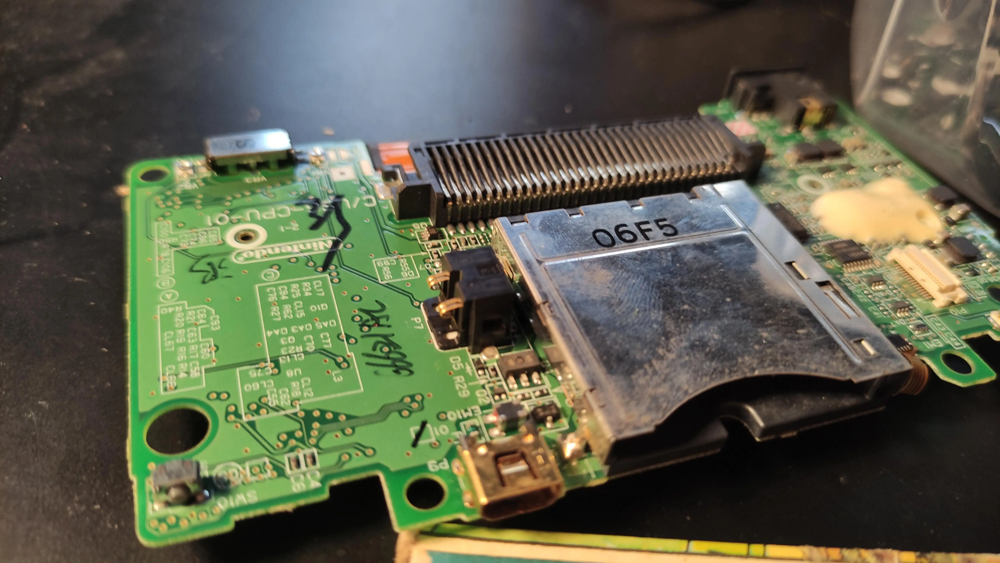

I took two broken Nintendo DS Lite consoles and made one that works. It was my first try at fixing electronics, and it worked!

## The Problem

My old Nintendo DS Lite had been broken since I was a kid. I wanted to fix it, but I didn't know how.

## How I Fixed It

1. **Getting Parts**: I bought another broken Nintendo DS Lite cheap. It had different problems from mine.

2. **Mixing Parts**: I opened up both Nintendo DS Lites. I figured out which parts still worked in each one.

3. **Soldering**: The hardest part was soldering a tiny switch. I didn't have the right tools, but I tried anyway.

4. **Putting It Back Together**: After soldering, I put all the working parts into one Nintendo DS Lite.

## What Happened

To my surprise, it worked! When I turned it on and saw it working, I felt really excited. I couldn't believe I had fixed it on my first try.

This project taught me that it's fun to fix old stuff. Sometimes, giving it a try can lead to great results, even if you're not an expert.

## Pictures

Here are some photos from when I was fixing it:

