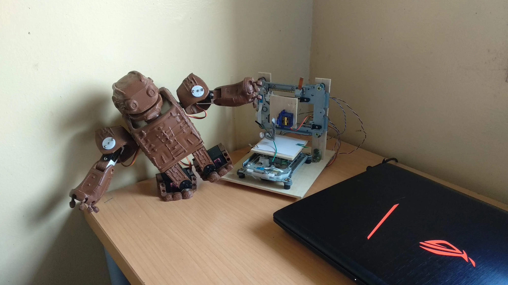
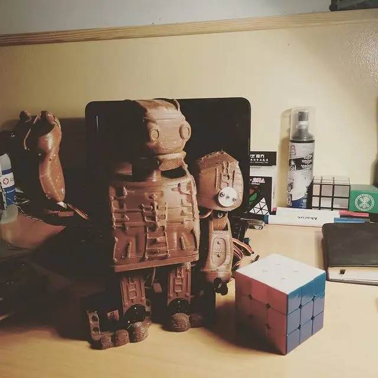
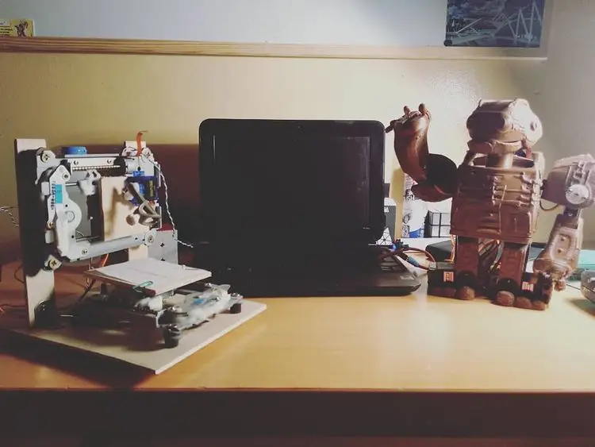

This page showcases two small robotics projects I've created: Hubert, a biped robot, and Plotter, a 2D drawing robot. Both were built using a combination of 3D printed parts and salvaged computer components.

## Hubert: The Biped Robot

Hubert is a modified version of the Zowi biped robot, originally designed by BQ.

Key features of Hubert:
- Brown in color
- Based on the Zowi biped robot design
- Modified from the original BQ version
- Controlled by Arduino

I ended up donating Hubert to my high school, where it can inspire other students interested in robotics.

## Plotter: The 2D Drawing Robot

Plotter is a small project that functions like a 2D version of a 3D printer.

Key features of Plotter:
- Can draw in 2D when given a pen or pencil
- Built using 3D printed parts
- Controlled by Arduino

Plotter can be used for creating simple drawings, signatures, or even as a base for more complex 2D CNC projects.

## Building Process

Both robots were created using a combination of:
- 3D printed parts
- Scrap computer components
- Arduino boards for control

This approach to building robots demonstrates how you can create interesting and functional projects with a mix of new technology (3D printing) and recycled materials.

These projects show that with some creativity and basic electronics knowledge, you can build fun and educational robots using readily available materials and open-source designs.
